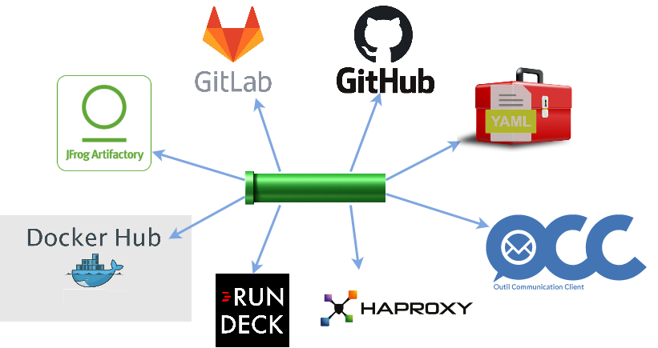

# Hesperides Pipeline



**Note**: ces pipelines font suites aux pipelines Travis CI :
- https://travis-ci.org/voyages-sncf-technologies/hesperides
- https://travis-ci.org/voyages-sncf-technologies/hesperides-gui

## Description des pipelines

### Pipelines de détection de nouvelle version

- `Jenkinsfile_detect_new_docker_hub_backend_image` ([job jenkins](https://usl.jenkins.cloud.socrate.vsct.fr/job/A_USL/job/Hesperides/job/detect_new_docker_hub_backend_image/)):
_poll_ Docker hub jusqu'à ce qu'une nouvelle version `latest` publiée soit détecté

- `Jenkinsfile_detect_new_docker_hub_frontend_image` ([job jenkins](https://usl.jenkins.cloud.socrate.vsct.fr/job/A_USL/job/Hesperides/job/detect_new_docker_hub_frontend_image/)):
_poll_ Docker hub jusqu'à ce qu'une nouvelle version `latest` publiée soit détecté

### Pipelines de build

- `Jenkinsfile_build_docker_image` ([job jenkins](https://usl.jenkins.cloud.socrate.vsct.fr/job/A_USL/job/Hesperides/job/build_docker_image/)):
Pipeline de création de l'image d'[Hesperides](https://github.com/voyages-sncf-technologies/hesperides) pour publication sur le dépôt Docker interne :
récupère l'image Docker du [Dockerhub public](https://hub.docker.com/r/hesperides/hesperides/) pour la surcharger avec le certificat de l'Active Directory, et la pusher vers Artifactory.
_cf._ [vsct-hesperides/Dockerfile](vsct-hesperides/Dockerfile)

Les commits contenant `#RT` dans leur message déclenchent l'exécution de `tests/regression` entre plateformes REL1 (en version `testing` contenant le dernier commit)
et INT1 (en version `latest` ne contenant pas ce dernier commit).

- `Jenkinsfile_build_docker_image_for_gui` ([job jenkins](https://usl.jenkins.cloud.socrate.vsct.fr/job/A_USL/job/Hesperides/job/build_docker_image_for_gui/)):
Pipeline de création de l'image d'[hesperides-gui](https://github.com/voyages-sncf-technologies/hesperides-gui) pour publication sur le dépôt Docker interne :
récupère l'image Docker du [Dockerhub public](https://hub.docker.com/r/hesperides/hesperides-gui/) pour la surcharger avec le certificat de l'Active Directory, et la pusher vers Artifactory.
_cf._ [vsct-hesperides-gui/Dockerfile](vsct-hesperides-gui/Dockerfile)

### Pipelines de déploiement

- `Jenkinsfile_promote` ([job jenkins](https://usl.jenkins.cloud.socrate.vsct.fr/job/A_USL/job/Hesperides/job/promote/)):
tag une image Docker avec une nouvelle version

- `Jenkinsfile_deploy` ([job jenkins](https://usl.jenkins.cloud.socrate.vsct.fr/job/A_USL/job/Hesperides/job/deploy/)):
  * est déclenché par les pipelines de build
  * déclenche un Puppet refresh via [le job pprundeck HES/Outils/refresh_puppet_agent](https://pprundeck.socrate.vsct.fr/rundeck/project/HES/job/show/03662b77-5169-4828-96e8-8ba855d6c441)
  * redémarre les instances pour tirer la dernière version en exécutant [le job pprundeck HES/Outils/RESTART](https://pprundeck.socrate.vsct.fr/rundeck/project/HES/job/show/c9f92ce5-2d20-4a57-9cb8-8e88aae5412f) qui effectue un `./SHUT && ./BOOT`

- `Jenkinsfile_deploy@PROD` ([job jenkins](https://usl.jenkins.cloud.socrate.vsct.fr/job/A_USL@PROD/job/Hesperides/job/deploy_PROD/)):
  * se déclenche toutes les nuits, 1 fois pour `PRD6` puis 30min plus tard pour `PRD1`
  * détecte si une nouvelle image Docker _frontend_ ou _backend_ a été publiée, et s'interrompt immédiatement si ce n'est pas le cas
  * insère l'événement en fresque OCC
  * déclenche un Puppet refresh via [le job rundeck HES/Outils/refresh_puppet_agent](https://rundeck.socrate.vsct.fr/rundeck/project/HES/job/show/658f4899-7bba-4bb4-b14c-f8e18261247d)
  * redémarre les instances pour tirer la dernière version en exécutant [le job pprundeck HES/Outils/restart_docker](https://rundeck.socrate.vsct.fr/rundeck/project/HES/job/show/a42fe40a-48a4-4d0c-bba4-9abc097b591b) qui effectue un `./SHUT && ./BOOT`.
  La pipeline attend que chaque instance ait redémarrée avant de passer à la suivante.

- `Jenkinsfile_batch_hes2els` ([job jenkins](https://usl.jenkins.cloud.socrate.vsct.fr/job/A_USL@PROD/job/Hesperides/job/batch_hes2els/)):
cf. https://wiki.vsct.fr/pages/viewpage.action?pageId=217943778 & https://jira.vsct.fr/browse/USL-1073 pour le contexte

### Autres pipelines

- `Jenkinsfile_perf_tests` : lance les stress tests Gatling sur une plateforme

- `Jenkinsfile_zap` : _work in progress_ - tentative d'intégration du proxy [Zap de l'OWASP](https://www.owasp.org/index.php/OWASP_Zed_Attack_Proxy_Project) avec l'aide de Martin De Roquefeuil

## Tips

Tester une image docker pushée dans le registry privé vsct :
```cmd
docker login --username admgit --password 'XXXXXXXXX' https://hesperides-docker-all.artifact.cloud.socrate.vsct.fr
docker pull hesperides-docker-all.artifact.cloud.socrate.vsct.fr/hesperides/vsct-hesperides:develop
```
